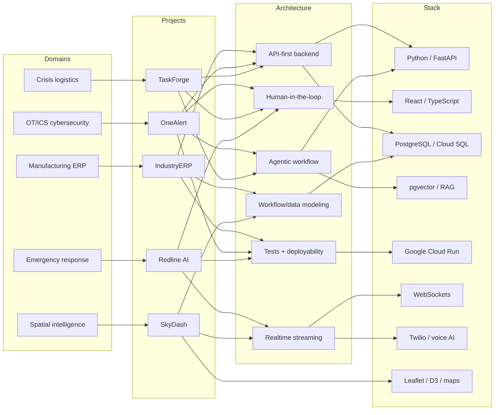

# Pinned Project Knowledge Graph

This graph maps the pinned repositories by domain, architecture, stack, and evidence. It is meant to make the GitHub profile easier to audit: each project should have a clear reason to be pinned and a clear relationship to the rest of the portfolio.

## Project Adjacency List

| Project | Domain | Core pattern | Stack anchors | Evidence to surface |
|---|---|---|---|---|
| [IndustryERP](https://github.com/mangod12/industryERP) | Manufacturing ERP | API-first workflow system; inventory and stage control | FastAPI, PostgreSQL/Cloud SQL, Cloud Run, GitHub Actions | Daily operations system; 172 endpoints; 6-role RBAC; spreadsheet replacement |
| [OneAlert](https://github.com/mangod12/OneAlert) | OT/ICS cybersecurity | AI-assisted SOC; human-in-the-loop response | FastAPI, React, PostgreSQL, Docker, Cloud Run | 30 stars; 330+ tests; 6 AI agents; MITRE ATT&CK mapping; Suricata/Zeek ingestion |
| [TaskForge](https://github.com/mangod12/TaskForge) | Crisis logistics | Multi-agent planning and fallback coordination | FastAPI, Gemini 2.5 Flash, MCP, PostgreSQL/pgvector | Google Cloud Gen AI Academy APAC 2026; 4-agent pipeline; deterministic fallback design |
| [Redline AI](https://github.com/mangod12/redline-AI) | Emergency response | Voice-to-structured-intelligence pipeline | FastAPI, Twilio, Whisper, PostgreSQL, Redis | 409 tests; 33 E2E tests; IVR-to-dashboard pipeline; Cloud SQL/Redis architecture |
| [SkyDash](https://github.com/mangod12/skydash) | Spatial intelligence | Real-time map dashboard and link analysis | React, FastAPI, Leaflet, D3, SQLite, WebSockets | Geospatial maps; OSINT-style entities; missions; exports; simulated 10Hz telemetry |

## Cross-Project Themes

- Production backends: IndustryERP, OneAlert, TaskForge, Redline AI.
- Security automation: OneAlert, AiSOC contribution, Redline AI incident response.
- Agentic AI: TaskForge, OneAlert, Redline AI.
- Real-time systems: SkyDash, Redline AI, OneAlert event ingestion.
- Workflow-first engineering: IndustryERP, TaskForge, SkyDash mission/entity modeling.
- Cloud delivery: IndustryERP and OneAlert have verified working Cloud Run links; TaskForge and Redline AI are kept as repo links in the profile until their demos return stable HTTP 2xx responses.
