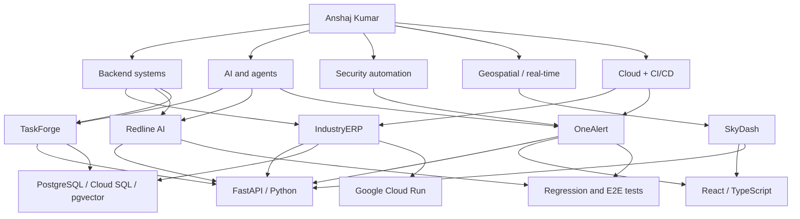

### Hi, I'm Anshaj.

Backend + AI systems engineer focused on geospatial intelligence, security automation, production backends, and agentic workflows.

CS @ KIIT '27 - currently at [CWI Studios](https://cwistudio.in) - Bokaro / Bhubaneswar - open to AI systems, geospatial, security automation, and backend engineering internships.

---

#### Pinned project map

[Full pinned-project knowledge graph](KNOWLEDGE_GRAPH.md) - [link and metadata audit](AUDIT.md)

---

#### Shipped systems

| Project | What it is | Proof | Stack | Link |
|---|---|---|---|---|
| **[IndustryERP](https://github.com/mangod12/industryERP)** | ERP for a steel fabrication business | Used in daily operations; 172 endpoints; 6-role RBAC; replaced spreadsheet workflows | FastAPI, PostgreSQL/Cloud SQL, Cloud Run, GitHub Actions | [open](https://kbsteel-backend-498310931350.asia-south1.run.app) |
| **[OneAlert](https://github.com/mangod12/OneAlert)** | Open-source OT/ICS security OS | 30 stars; 330+ tests; 6 AI agents; MITRE ATT&CK mapping; Suricata/Zeek events | FastAPI, React 19, PostgreSQL, Docker, Cloud Run | [open](https://cybersec-saas-498310931350.us-central1.run.app) |
| **[TaskForge](https://github.com/mangod12/TaskForge)** | Multi-agent crisis logistics coordinator | Built for Google Cloud Gen AI Academy APAC 2026; 4-agent pipeline; deterministic fallbacks | FastAPI, Gemini 2.5 Flash, MCP, PostgreSQL/pgvector, Cloud Run | [repo](https://github.com/mangod12/TaskForge) |
| **[Redline AI](https://github.com/mangod12/redline-AI)** | Emergency dispatch IVR and dashboard | 409 tests; 33 E2E tests; Whisper + ONNX pipeline; Cloud SQL/Redis architecture | FastAPI, Twilio, Whisper, PostgreSQL, Redis | [repo](https://github.com/mangod12/redline-AI) |
| **[SkyDash](https://github.com/mangod12/skydash)** | Open-source spatial intelligence dashboard | Geospatial maps; OSINT-style entities; link analysis; missions; simulated 10Hz telemetry | React, FastAPI, Leaflet, D3, SQLite, WebSockets | [repo](https://github.com/mangod12/skydash) |

---

#### More projects

- **[VitalWatch](https://github.com/mangod12/VitalWatch)** - real-time patient event detection with YOLOv8, MediaPipe, FastAPI, WebSockets, and a live dashboard.
- **[SmartFlow Todo RN](https://github.com/mangod12/smartflow-todo-rn)** - React Native + Firebase task app with real-time sync, auth, and priority scoring.
- **[AI Ops Log Intelligence](https://github.com/mangod12/alloydb-ai-nl-sql)** - natural-language-to-SQL dashboard on AlloyDB AI.
- **[P2P SAP BTP](https://github.com/mangod12/p2p-sap-btp)** - Procure-to-Pay workflow on SAP CAP/UI5/HANA.

---

#### Open-source contributions

- **[Biome](https://github.com/biomejs/biome)** - merged CLI fix for rdjson code-suggestion replacement output: [PR #10543](https://github.com/biomejs/biome/pull/10543).
- **[AutoGPT](https://github.com/Significant-Gravitas/AutoGPT)** - merged orchestrator fix forwarding credential input masks into tool-node execution: [PR #13151](https://github.com/Significant-Gravitas/AutoGPT/pull/13151).
- **[AiSOC](https://github.com/beenuar/AiSOC)** - reported cross-tenant RBAC isolation gaps and proposed endpoint-level regression/security CI coverage in [issue #159](https://github.com/beenuar/AiSOC/issues/159); credited in merged contributor/security credits update [PR #223](https://github.com/beenuar/AiSOC/pull/223).

---

#### How I work

I start from the workflow, not the framework. For IndustryERP, that meant interviewing operators at a steel plant before writing the data model. For the AI projects, it means using agents, MCP, RAG, or real-time streaming only when they make the system more useful than a normal API would.

I like small, observable backends: clear domain boundaries, tests that cover real failure modes, CI/CD from day one, and deployments people can actually open.

#### Stack

- **Backend:** Python, FastAPI, SQLAlchemy, Pydantic, REST APIs, WebSockets
- **Data:** PostgreSQL, SQLite, Redis, pgvector, pandas
- **Frontend:** React, TypeScript, React Native, Tailwind CSS, Leaflet, D3
- **Cloud:** Docker, Google Cloud Run, Cloud SQL, Cloud Build, GitHub Actions
- **AI:** Gemini API, MCP, RAG, embeddings, Whisper, ONNX, NLP pipelines
- **Ops:** Prometheus, Grafana, CI/CD, RHEL-certified

---

#### Currently

- Building **Blue**, an internal platform powering CWI Studios operations.
- Looking for backend, systems, security, geospatial, or AI engineering internships where I can ship to real users.

anshajkumar341@gmail.com - [LinkedIn](https://www.linkedin.com/in/anshajk/) - [Portfolio](https://anshajwebsite.vercel.app)
